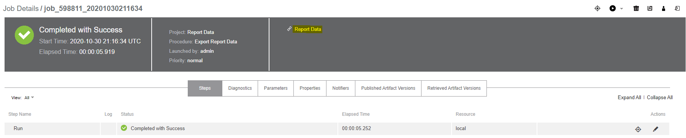
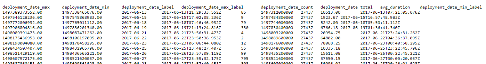
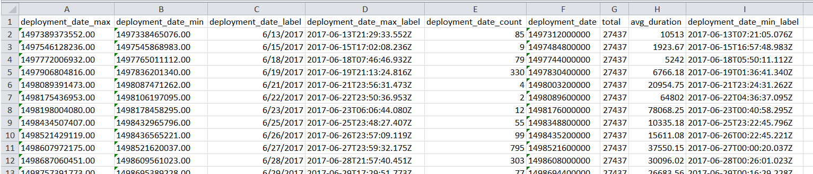

# Export Report Data

## Description

Create a self-service catalog item that can be used to generate a tab-delimited file from a DevOps Insight
widget (report).

### Installing

* Edit `ExportReportData.groovy` and change the default properties to meet your needs as follows:

    * `CurrentProject` - The project 

```
def CurrentProject = 'dslsamples'

project CurrentProject,{
    procedure "Export Report Data",{
        formalParameter "ProjName", required: true
        formalParameter "DashName", required: true
        formalParameter "WidName", required: true
...
...
...
```

* Run the DSL `ExportReportData.groovy` to install

## Example


Create a self-service catalog item that can be used to generate a tab-delimited file from a DevOps Insight
widget (report).





