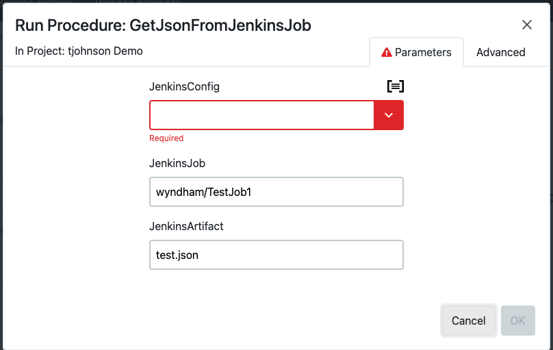

# GetJsonFromJenkinsJob

## Description

This procedure gets a JSON file that has been marked as an artifact in a Jenkins/Cloudbees CI server, convert the JSON into a property set and make it available to other tasks in CDRO.  This procedure uses the json2properties procedures to process at json file collected from the Jenkins/Cloudbees CI server and the Jenkins plugin.  You will also need to configure a connection to your Jenkins server or Cloudbees CI server as a Jenkins server.


### Installing

#### Installing json2properties

* Edit `GetJsonFromJenkinsJob.groovy` and change `CurrentProject` to the project you want to install to

```
ef CurrentProject = 'dslsamples'

procedure 'GetJsonFromJenkinsJob', {
  projectName =  CurrentProject,
  timeLimit = '0'

...
...
...
```

* Run the DSL `GetJsonFromJenkinsJob.groovy` to install

#### Installing properties2json

* Edit `GetJsonFromJenkinsJob.groovy` and change `CurrentProject` to the project you want to install to

```
def CurrentProject = 'dslsamples'

project CurrentProject,{
	// Sample property sheet
	property "expandedJson",{
...
...
...
```

* Run the DSL `GetJsonFromJenkinsJob.groovy` to install

## Example

#### Running json2properties

The first step here will be to use the [GetJsonFromJenkinsJob](GetJsonFromJenkinsJob.groovy) procedure to create a property sheet in  the default project.  Running `GetJsonFromJenkinsJob`  looks like the following:


