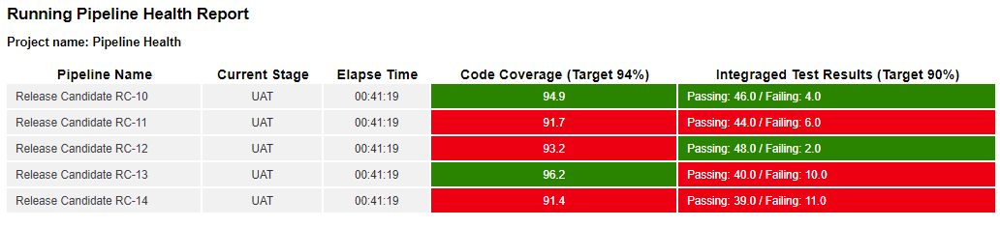

# Pipeline Health Report
A report that shows metrics of running pipelines that are intended for attachment to a release

## Instructions
1. Use run the DSL Pipeline.groovy to create a sample pipeline and run 5 instances of it
1. Make sure you have the Unplug plugin installed
1. Save the Unplug groovy code in UnplugPipelineHealth.groovy to a /server/unplug property (see the file for details)
1. Use the link provided in UnplugPipelineHealth.groovy to access the report