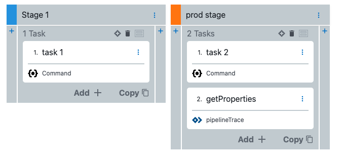
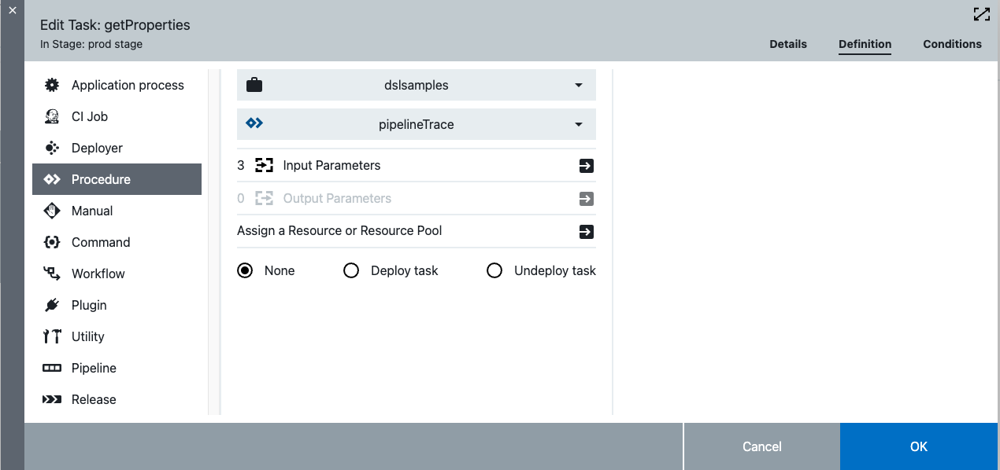
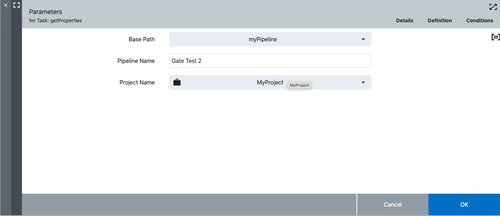
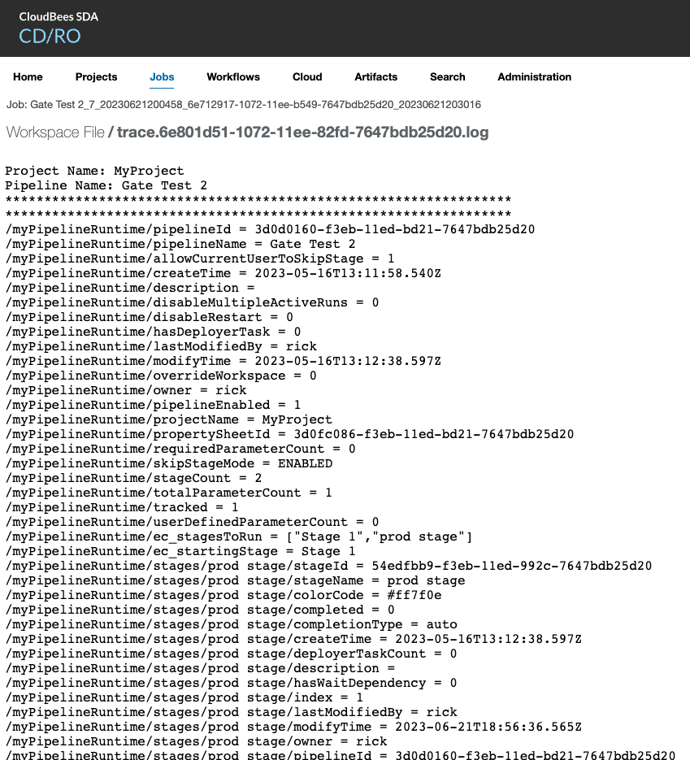

# Property Browsers

## Description

It is often difficult to figure out what the path will be to a property in CD/RO.  The *procedures* can be used to list available properties that will be available in CD/RO.

## Pipeline Trace

The `pipelineTrace` procuedure can be used in a pipeline or a release to get a list of all of the properties in `/myPipeline` and `/myPipelineRuntime`

### Installing

* Edit `pipelineTrace.groovy` and change `CurrentProject` to the project you want to install to

```
def CurrentProject = 'dslsamples'

procedure 'projectTrace', {
  projectName = CurrentProject
  timeLimit = '0'
...
...
...
```

* Run the DSL `pipelineTrace.groovy` to install


## Project Trace

The `projectTrace` procedure can be used to find all of the properties under a project.

## Examples

To get the list of current properties put the `pipelineTrace` after the last task that you want to get all of the properties for as follows:



The `getProperties` will run the `pipelineTrace` procedure.  An example of this procedure is as follows:



The procedure requres parameters as  follows:



The output of the procedure will look like the following:


