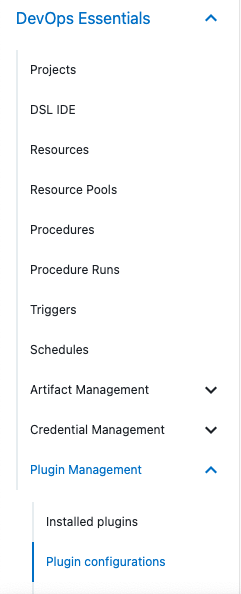
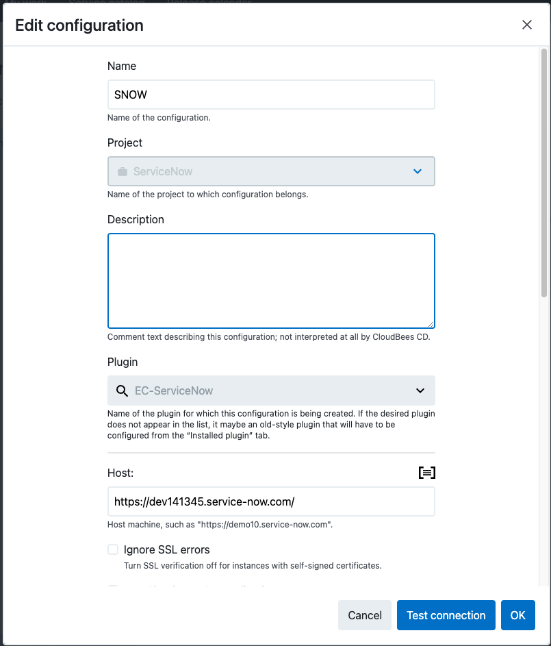
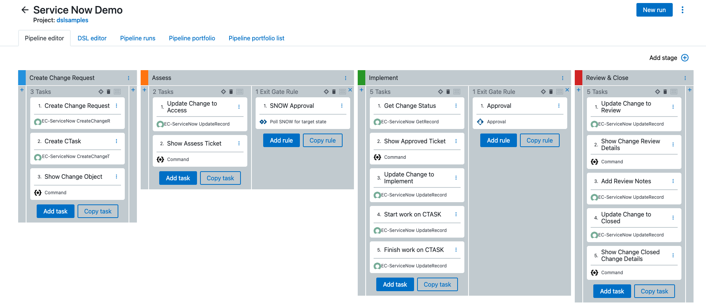
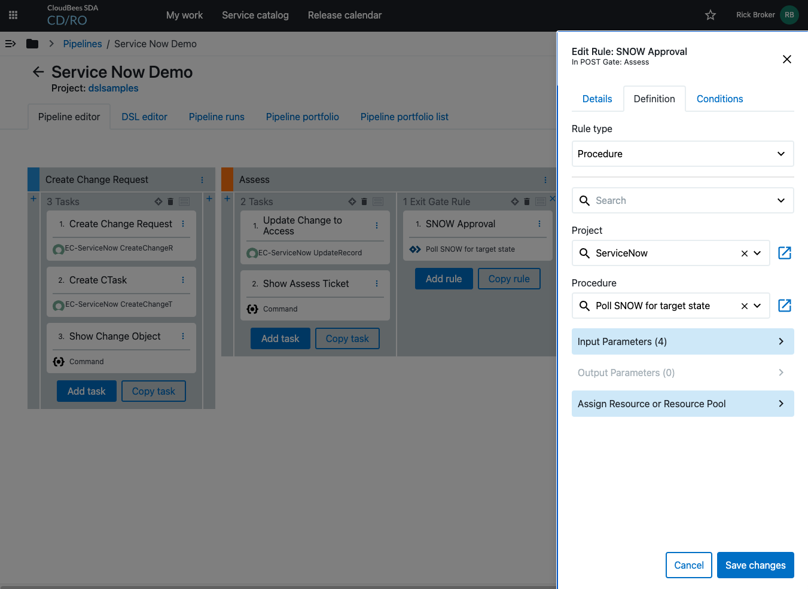

# Service Now Polling

## Description

The *Poll SNOW for target state*  procedure is a polling task to check if a `RecordID` had changed to a specific `State`.  You can use this procedure if you don't have the **Service Now** integration or network access to CD/RO as a task in an exit or entrance gate in a pipeline or release.   Furthermore, there is an example pipeline ( [Demo Pipeline](Demo_Pipeline.groovy) ) that you can use with the **EC-ServiceNow** plugin to examaine how to use Service Now with CD/RO

### Installing

* Edit `ServiceNowPolling.groovy` and change the default properties to meet your needs as follows:

    * `CurrentProject` - The project where you want to install this procedure

```
def currentProject = 'dslsamples'


project currentProject, {
procedure 'Poll SNOW for target state', {

...
...
...
```

* Run the DSL `Demo_Pipeline.groovy` to install

You can also install the example pipeline to  see this procedure in action as follows:

* Create a **EC-ServiceNow** configuration as follows:
    * From the *Hamburger Menu*  select **DevOps Essentials->Plugin Management->Plugin configuration**
    
    * **Add plugin configuration**
    

* Edit `Demo_Pipeline.groovy` and change the default properties to meet your needs as follows:

    * `CurrentProject` - The project where you want to install this procedure

```
ddef currentProject = 'dslsamples'

pipeline 'Service Now Demo', {
  projectName = currentProject

...
...
...
```

* Run the DSL `ServiceNowPolling.groovy` to install

**Note:** depending on how you named your ServiceNow configuration you may need to make similar changes to the pipeline

## Example

The installed pipeline should look something like the following:



The **ServiceNow** procedure in the pipeline will look like the following:



If you would like to watch a video on the pipeline running you can check out the Youtube link  bellow

[](https://youtu.be/MEvfoWISU-8 "Youtube Video")