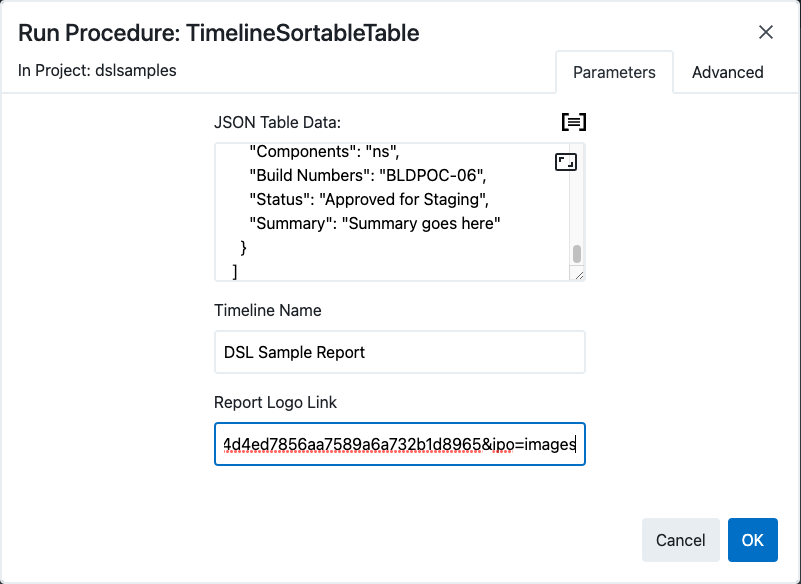
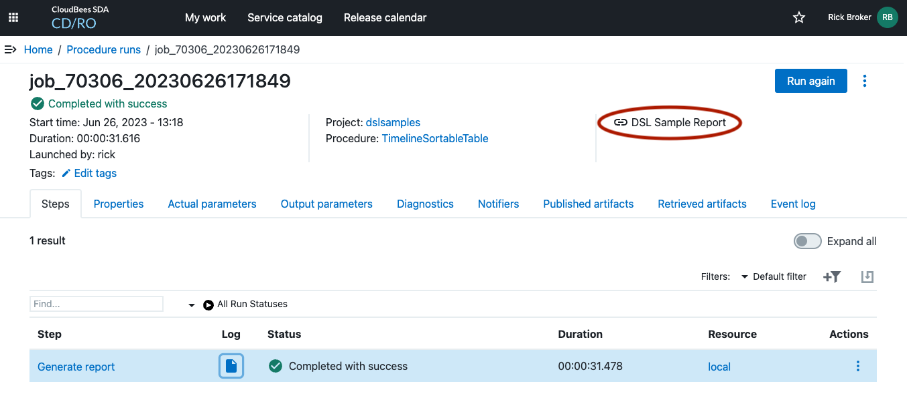
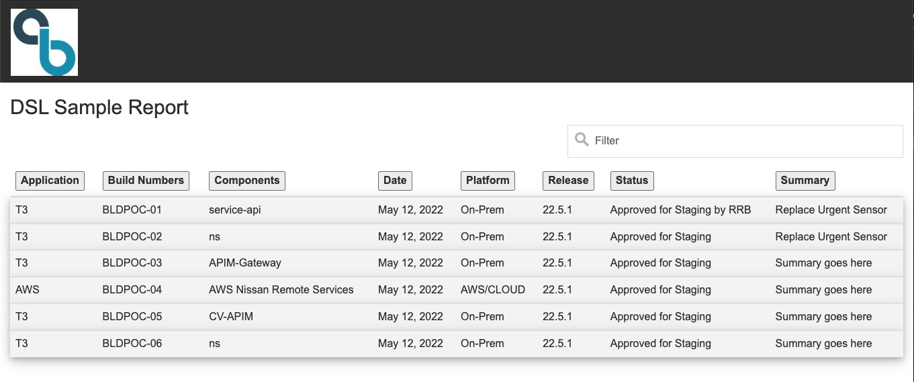

# Sortable Table

## Description

This procedure creates a sortable html table with a link in the UI from a JSON object.

### Installing

* Edit `SortableTable.groovy` and change `CurrentProject` to the project you want to install to

```
def CurrentProject = 'dslsamples'

procedure 'projectTrace', {
  projectName = CurrentProject
  timeLimit = '0'
...
...
...
```

* Run the DSL `SortableTable.groovy` to install


## Examples

This procedure requires on parameter (`jsonData`).  The procedure will transform the json object into a talbe using the field names as column headers.  An example of possible `jsonData` is bellow:

```
[
    {
      "Date": "May 12, 2022",
      "Release": "22.5.1",
      "Platform": "On-Prem",
      "Application": "T3",
      "Components": "service-api",
      "Build Numbers": "BLDPOC-01",
      "Status": "Approved for Staging by RRB",
      "Summary": "Replace Urgent Sensor"
    },
    {
      "Date": "May 12, 2022",
      "Release": "22.5.1",
      "Platform": "On-Prem",
      "Application": "T3",
      "Components": "ns",
      "Build Numbers": "BLDPOC-02",
      "Status": "Approved for Staging",
      "Summary": "Replace Urgent Sensor"
    },
    {
      "Date": "May 12, 2022",
      "Release": "22.5.1",
      "Platform": "On-Prem",
      "Application": "T3",
      "Components": "APIM-Gateway",
      "Build Numbers": "BLDPOC-03",
      "Status": "Approved for Staging",
      "Summary": "Summary goes here"
    },
    {
      "Date": "May 12, 2022",
      "Release": "22.5.1",
      "Platform": "AWS/CLOUD",
      "Application": "AWS",
      "Components": "AWS Nissan Remote Services",
      "Build Numbers": "BLDPOC-04",
      "Status": "Approved for Staging",
      "Summary": "Summary goes here"
    },
    {
      "Date": "May 12, 2022",
      "Release": "22.5.1",
      "Platform": "On-Prem",
      "Application": "T3",
      "Components": "CV-APIM",
      "Build Numbers": "BLDPOC-05",
      "Status": "Approved for Staging",
      "Summary": "Summary goes here"
    },
    {
      "Date": "May 12, 2022",
      "Release": "22.5.1",
      "Platform": "On-Prem",
      "Application": "T3",
      "Components": "ns",
      "Build Numbers": "BLDPOC-06",
      "Status": "Approved for Staging",
      "Summary": "Summary goes here"
    }
  ]
  ```

  Once you have this data in a property or you can pass it directly to the procedure, you can run the procedure as follows:
  1. Click on the *New Run* button a provide at least the json above and any other properties you want to use.   You  can optionally provide a `Timeline Name` and a `Report Logo Link`

  

  When the run is complete the link to the report will be on the summary page as follows:

  

  The sortable table of the run with the above data will look like the following:

  
  
