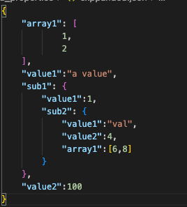
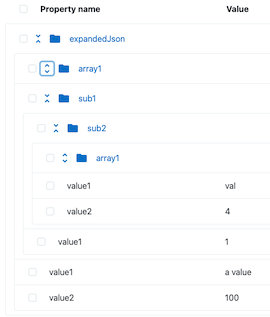
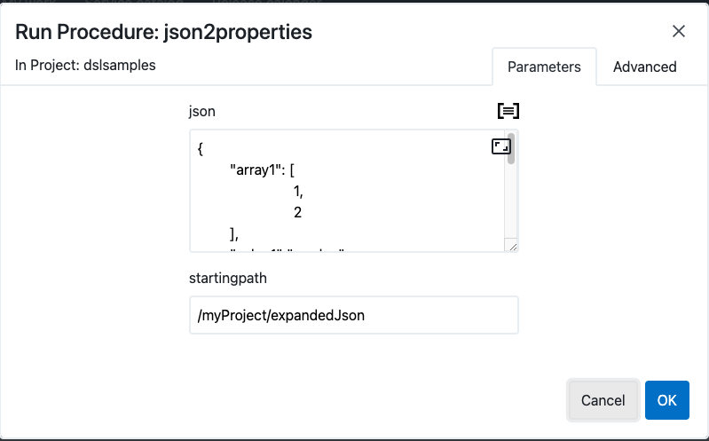
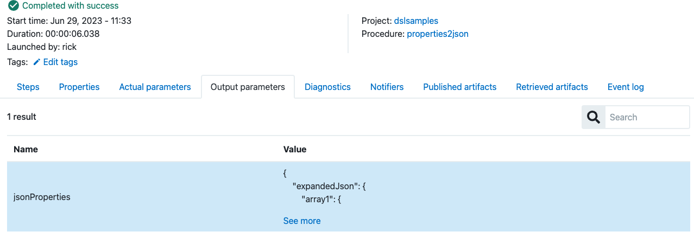
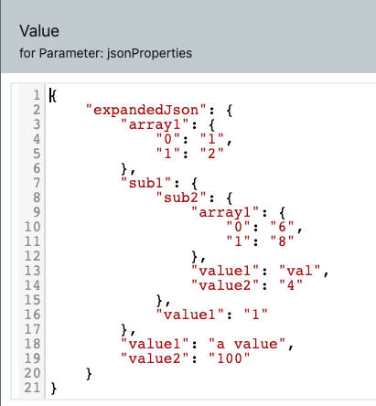

# json2properties & properties2json

## Description

This set of procedures can be used to convert json objects to CD/RO propertiy structures and from property structures back to json objects.  This creates a convienent way to store data from rest calls or parameters or rest calls.

|    JSON    |     Properties  |
|----        |----             |
|  |  |

### Installing

#### Installing json2properties

* Edit `json2properties.groovy` and change `CurrentProject` to the project you want to install to

```
def CurrentProject = 'dslsamples'

def CurrentProject = 'dslsamples'

project CurrentProject,{
	procedure "json2properties",{
		formalParameter "startingpath", defaultValue: "/myProject/expandedJson"
...
...
...
```

* Run the DSL `json2properties.groovy` to install

#### Installing properties2json

* Edit `properties2json.groovy` and change `CurrentProject` to the project you want to install to

```
def CurrentProject = 'dslsamples'

project CurrentProject,{
	// Sample property sheet
	property "expandedJson",{
...
...
...
```

* Run the DSL `properties2json.groovy` to install

## Example

#### Running json2properties

The first step here will be to use the [json2properties](json2properties.groovy) procedure to create a property sheet in  the default project.  Running `json2properties`  looks like the following:



The JSON property value is as follows:

```
{
    "array1": [
            1,
            2
    ],
    "value1":"a value",
    "sub1": {
        "value1":1,
        "sub2": {
            "value1":"val",
            "value2":4,
            "array1":[6,8]
        }
    },
    "value2":100
}
```

You could change this structure to be anything you like.

The resulting property sheet under the target project would look like the following:


#### Running properties2json

Once there is a property sheet that needs to be converted  to a json object it is possible to use [properties2json](properties2json.groovy).  Running `properties2json` looks like the following:

[alt text](img/RunProcedure_propertis2json.png)

When the procedure runs the property sheet converted to json will be in the output parameters as follows:




